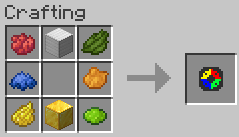

# Dyeable-Minecraft Mod (1.19)
 Minecraft mod that allows an easier time dyeing items.

## Current Addition/s
<b>Dye Gadget -</b>

 

 <i>
Can use any dye in the crafting recipe</i>

 - Right click in the air to change dye color
 - Right click dyed block to change its color to the selected dye color.
  - Current Blocks:
    - Wool
    - Carpet
    - Terracotta
    - Glazed Terracotta
    - Concrete
    - Concrete Powder
    - Glass
    - Glass Pane
    - Candle
 - Right click sheep to dye it to the selected dye color.
